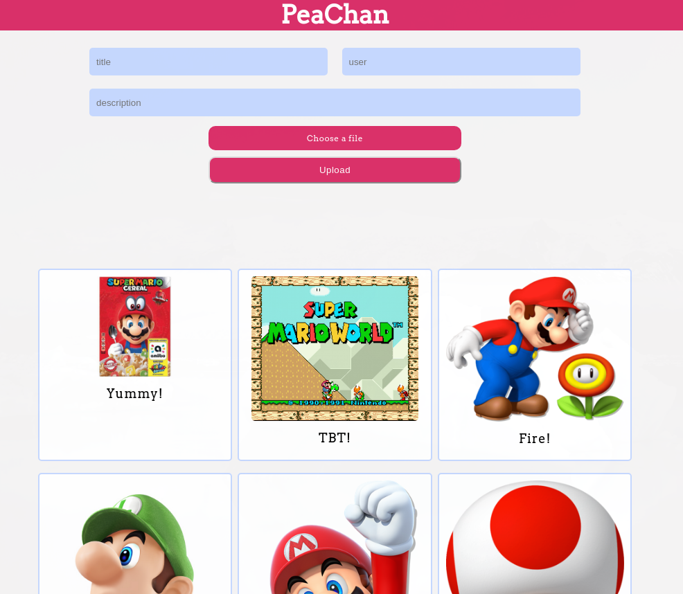
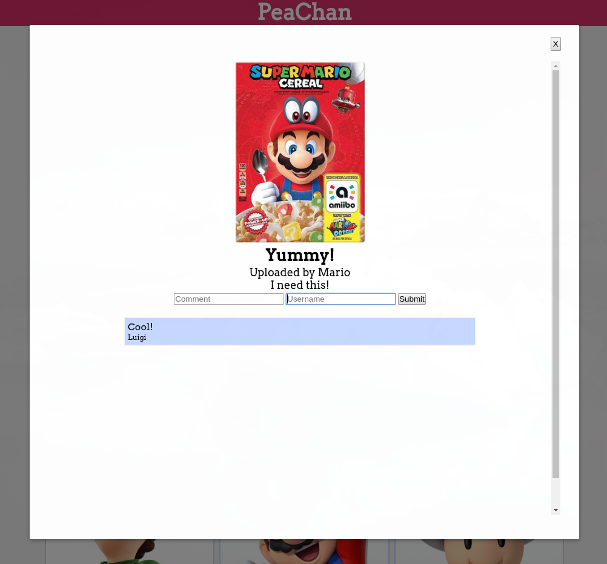

# PeaChan
An Super Mario themed imageboard made with Vue.js

## Screenshots

## Features
* Users can upload images
* Images are saved in an S3 bucket
* Users can comment on uploaded images
* Images are displayed with pagination
* Clicking on an image opens a modal with a larger image

## Tech
* Vue.js
* Express
* PostgreSQL
* Amazon S3
